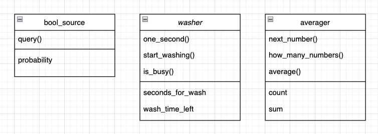

# Airport Simulation

- Accept [08_09_airport](https://classroom.github.com/a/L0hfr0m_)
- Get [basic_test.cpp](basic_test.cpp)

---


## [Car Wash Simulation](car_wash.md)



Take a very close look at the [Car Wash Simulation](https://replit.com/@StephenWang9/0801carwashsimulation#main.cpp) in Chapter 8. It is a very well-designed and insightful program that introduces key concepts that are used in design of the Airport Simulation program. (You must use the concepts and classes used in the Car Wash Simulation in your project)

You will be using your own Queue class for this project. 

Running the Car Wash Simulation using your own Queue class and providing detailed comments will be very helpful in implementing the Airport Simulation program. You need to know exactly how the different pieces fit together. Doing this will cut your development time in half.


## [Airport Simulation](airport.md)

Here are some of the variables Airport Simulation will keep track of:

```cpp
unsigned int landing_time,  // the amount of time needed for one plane to land
unsigned int takeoff_time,  // the amount of time needed for one plane to take off
double landing_probability, // the probability of arrival of planes to the landing queue
double takeoff_probability, // the probability of arrival of planes to the takeoff queue
unsigned int fuel_limit,    // the maximum amount of time that a plane can stay in the landing queue without running out of fuel and crashing;
unsigned int total_time;    // the total length of time to be simulated.
```

If I were you, I would write a class to take care of all these variables and to perform the simulation. Run your program once with the debug flag on (printing all your debugs) and once without the debug so it prints the results only.

Use these values to test your program. (Thanks to Andrew Miner for these values)

```cpp
unsigned int landing_time = 5;
unsigned int takeoff_time = 15;
double landing_probability = 0.10;
double takeoff_probability = 0.8;
unsigned int fuel_limit = 20;
unsigned int total_time = 1440;
```

Sample (no debug) run:

```
============================================
time to land:         : 5
time to take off      : 15
probability of landing: 0.1
probability of takeoff: 0.08
fuel: time to crash   : 20
total simulation time : 1440


. . . . . . . . . . . . . . . . . . . . . . . 
145 landed
48 took off
2 planes crashed. :(
Average waiting time to land: 9
Average waiting time to take off: 457.271
planes in landing queue : 0
planes in take off queue: 72
============================================
```

Run this program a few dozen times and see how the results will differ.

Also try running for a much longer period of time like 100000. Try running this a few times and report your observations.

REPORT YOUR FINDINGS in the `README.md`
