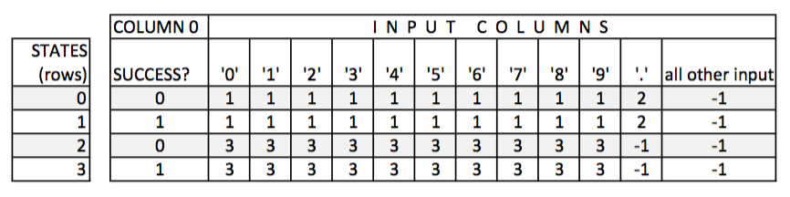
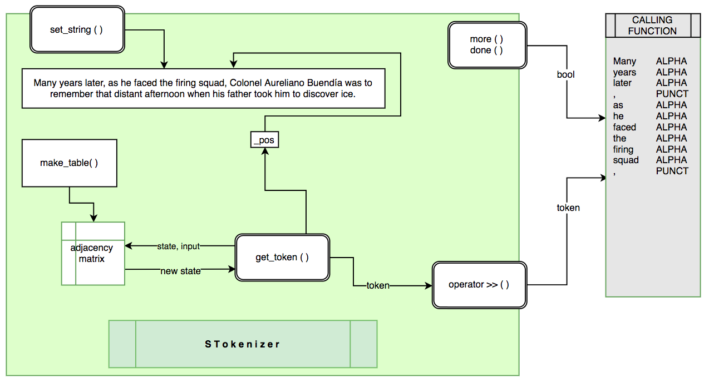

# State Machine Tokenizer

- Accept [99_02_tokenizer](https://classroom.github.com/a/1e-Ku71L)
- Get [basic_test.cpp](basic_test.cpp)

---

## Introduction

Consider a system that accepts or rejects strings of input. Assume the system has the following rules:

Acceptable "sentences" consist of:

1. one or more "A" elements, or
2. one or more "A" elements, followed by a "B" element, followed by one or more "A" elements again.

Here are examples of valid sentences:

```
A
AAAA
AAA..AAAA
AAABAA
ABAAA
```

The following are examples of invalid (rejected) sentences:

```
[EMPTY INPUT]
BAAAA
AAB (AA can be considered a valid sentence, but not AAB)
```

## State Machine

One can express these rules using a graph (also called a state machine):


In this graph, the `arrows` represent the "input" and the `circles` represent "states". Circles with double line are called "success states".

As we process input one item at a time and follow the arrow from one state to the next, at some point (may be at the end of the input), we arrive at a state for whom there is no arrow to the next state. At this point, the input we received (and the data we assembled using that input) at the last success state is a valid input.

Consider the input: `AABA.`. We begin at state 1, we take input A, we follow the arrow to state 2 [a success state]. we take another input A (the second A in the input) and we follow the loop arrow back to state 2 [a success state] we take the B as input, we follow the arrow from state 2 to state 3, and the third A will take us to state 4 [success state]. The period, however, is not in this grammar and that causes us to "fail", but all the input we gathered at the last success state (state 4: AABA) is acceptable input. All the input up to the period is considered processed.

### A state machine for a valid DOUBLE number


Bases on this state machine, [3.14], [23], [42.0], [.5] are all valid sentences. but [54.] is not

### Adjacency Matrix

We will use an "Adjacency Matrix" to represent a graph. We need to create a table (a two dimensional array) where the rows represent the states (0, 1, 2...) and the columns represent the possible inputs. The cells of the table where row R and column C intersect indicate the state to which R is connected to via input C. For example, if you are in state 1 and you see a decimal point, you will end up in state 2. If you are in state 2 and you see a decimal point, you will go to state -1 which does not exist, so your process will stop.

We will use column zero to store 1 to mark success states and fail states will be marked with 0.



### Formalizing the adjacency matrix

Declare a two dimensional int array with 30 rows and 256 columns. Each column of the array represents the ASCII value of all possible input characters. So, for input character '0', we will look at column 48 (ASCII value for '0')

Obviously, it will not be easy to manually fill and maintain this array accurately. So, we need [state machine functions](./tokenizer/state_machine_functions.h) to do that for us.

### A Function To Extract A Valid "Token" From A String Input

The function will take as input the table, the input string, the current position in the string and the start state. It tries to find the longest possible string that will end in a success state. If the function is successful, it will return true after resetting the position to the character following the last acceptable character in the string and storing the extracted string in object token.


## String Tokenizer Class



### Purpose

The String Tokenizer (STokenizer) returns a single token (via the extraction operator) from a string according to the rules set by its internal state machine. For now, the state machine is hard coded inside the STokenizer class, but it should not be difficult to allow the user to set or change the state machine from the calling entity.

### STokenizer Class

[STokenizer class](./tokenizer/stokenize.h) will:

- Receives an input string via the CTOR or the set_string function.
- Maintains the current position in this string.
- Uses a state machine (a graph implemented as an Adjacency Matrix) to recognize valid tokens
- `_more()` and `_done()` report existence of more tokens in the input string.
  - When no more token can be found in the string, `more()` and `done()` will return false and true respectively.
  - Test `_pos<=strlen(_buffer)`
- Extraction operator is repeatedly called to grab the next token, stores the string and its type in a Token object.
  - Returns an STokenizer reference.

In the stokenizer.cpp, you must reintroduce the _table static member variable once again:

```cpp
int STokenizer::_table[MAX_ROWS][MAX_COLUMNS] = {0};
```

### Preparing the table for the token DOUBLE

```c++
// Table for DOUBLE number
mark_fail(table, 0);            //Mark states 0 and 2 as fail states
mark_success(table, 1);         //Mark states 1 and 3 as success states
mark_fail(table, 2);
mark_success(table, 3);

mark_cells(0, table, DIGITS, 1);    //state [0] --- DIGITS ---> [1]
mark_cells(0, table, '.', '.', 2);  //state [0] --- '.' ------> [2] 
mark_cells(1, table, DIGITS, 1);    //state [1] --- DIGITS ---> [1]
mark_cells(1, table, '.', '.', 2);  //state [1] --- '.' ------> [2] 
mark_cells(2, table, DIGITS, 3);    //state [2] --- DIGITS ---> [3]
mark_cells(3, table, DIGITS, 3);    //state [3] --- DIGITS ---> [3]
```

### Token Class

The [token class](./tokenizer/token.h) is a package that is used by the STokenizer to send strings and types of tokens extracted from the input buffer to the calling entity. When a calling function calls the extract operator of the STokenizer, a Token object is returned. The Token class provides simple ways to interact with and report about these token strings.

### Token Types

You must use [constants.h](./tokenizer/constants.h) in your project.

## File Tokenizer Class


### Purpose

The File Tokenizer (FTokenizer) returns a single token (via the extraction operator) from a file.

The extraction operator of the FTokenizer object is repeatedly called to grab the next token in the file.

When no more token can be found in the string, `more()` and `done()` will return false and true respectively.

### FTokenizer Class

[FTokenizer Class](./tokenizer/ftokenize.h) will:

- Receives a file name via its constructor.
- Opens the file and reads a block of characters (`ifstream::read`) and sets up the STokenizer member object.
- As the extraction operator is called repeatedly, it receives a token from STokenizer and returns it.
- When `_stk` runs out of characters to process, it will refill `_stk` via its set_string function.
- If there are no more characters in the file to process, `more()` will return false.

### Test File

- [solitude_mini.txt](./tokenizer/solitude_mini.txt)
- [solitude.txt](./tokenizer/solitude.txt)
